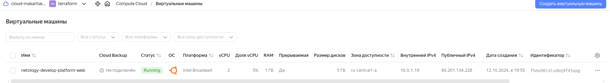
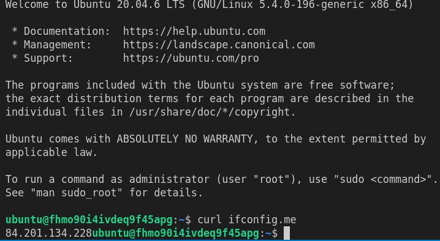
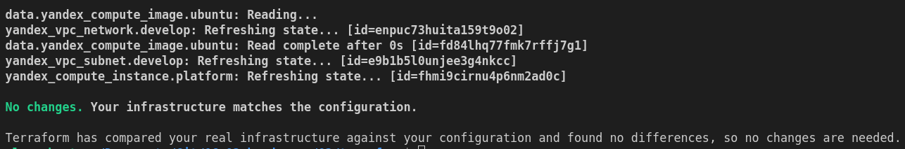
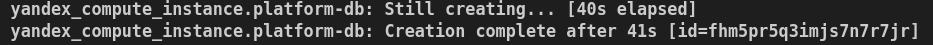
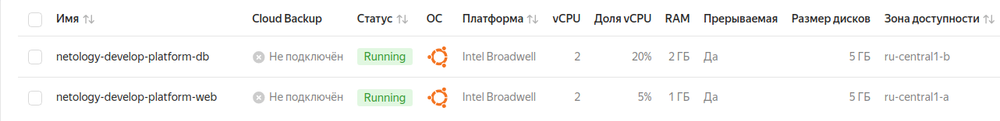
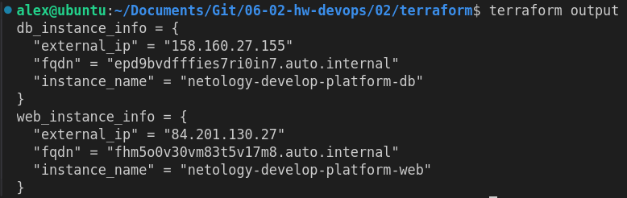
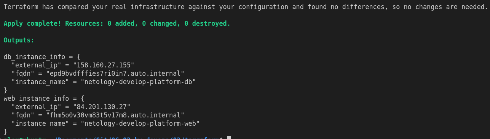
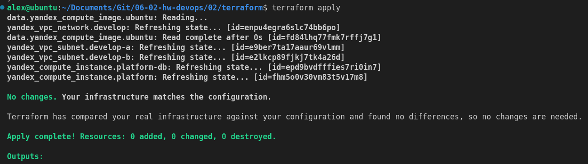

# Домашнее задание к занятию «Основы Terraform. Yandex Cloud» "Макарцев Александр Владимирович"

### Задание 0

1. Ознакомьтесь с [документацией к security-groups в Yandex Cloud](https://cloud.yandex.ru/docs/vpc/concepts/security-groups?from=int-console-help-center-or-nav). 
Этот функционал понадобится к следующей лекции.

------
### Внимание!! Обязательно предоставляем на проверку получившийся код в виде ссылки на ваш github-репозиторий!
------

### Задание 1
В качестве ответа всегда полностью прикладывайте ваш terraform-код в git.
Убедитесь что ваша версия **Terraform** ~>1.8.4

1. Изучите проект. В файле variables.tf объявлены переменные для Yandex provider.
2. Создайте сервисный аккаунт и ключ. [service_account_key_file](https://terraform-provider.yandexcloud.net).
4. Сгенерируйте новый или используйте свой текущий ssh-ключ. Запишите его открытую(public) часть в переменную **vms_ssh_public_root_key**.
5. Инициализируйте проект, выполните код. Исправьте намеренно допущенные синтаксические ошибки. Ищите внимательно, посимвольно. Ответьте, в чём заключается их суть.
6. Подключитесь к консоли ВМ через ssh и выполните команду ``` curl ifconfig.me```.
Примечание: К OS ubuntu "out of a box, те из коробки" необходимо подключаться под пользователем ubuntu: ```"ssh ubuntu@vm_ip_address"```. Предварительно убедитесь, что ваш ключ добавлен в ssh-агент: ```eval $(ssh-agent) && ssh-add``` Вы познакомитесь с тем как при создании ВМ создать своего пользователя в блоке metadata в следующей лекции.;
8. Ответьте, как в процессе обучения могут пригодиться параметры ```preemptible = true``` и ```core_fraction=5``` в параметрах ВМ.

В качестве решения приложите:

- скриншот ЛК Yandex Cloud с созданной ВМ, где видно внешний ip-адрес;
- скриншот консоли, curl должен отобразить тот же внешний ip-адрес;
- ответы на вопросы.

#### Решение




При инициализации ошибки были в "yandex_compute_instance":
- ```platform_id = "standart-v4"```- отсутсвует v4, можно указать варианты standard v1-3
- ```cores         = 1```- минимальное количество ядер 2

Параметры ```preemptible``` и ```core_fraction``` помогут сэкономить предоставленный грант на использовании ресурсов:
- ```preemptible = true``` - прерываемые виртуальные машины стоят дешевле обычных, что позволяет значительно сократить расходы на вычислительные ресурсы в обучающих проектах
- ```core_fraction = 5``` - указание небольшого значения для ```core_fraction``` (доля процессорного времени) позволяет запускать менее требовательные задачи, оптимизируя использование процессорных ресурсов и снижая затраты

### Задание 2

1. Замените все хардкод-**значения** для ресурсов **yandex_compute_image** и **yandex_compute_instance** на **отдельные** переменные. К названиям переменных ВМ добавьте в начало префикс **vm_web_** .  Пример: **vm_web_name**.
2. Объявите нужные переменные в файле variables.tf, обязательно указывайте тип переменной. Заполните их **default** прежними значениями из main.tf. 
3. Проверьте terraform plan. Изменений быть не должно.

#### Решение
Добавил необходимые переменные в variables.tf  
В main.tf заменил хардкод-значения:
```go
resource "yandex_compute_instance" "platform" {
  name        = var.vm_web_name
  platform_id = var.vm_web_platform
  metadata    = var.vm_metadata
  resources {
    cores         = var.vm_resources.web.cores
    memory        = var.vm_resources.web.memory
    core_fraction = var.vm_resources.web.core_fraction
  }
  boot_disk {
    initialize_params {
      image_id = data.yandex_compute_image.ubuntu.image_id
    }
  }
  scheduling_policy {
    preemptible = var.vm_web_policy_preemptible
  }
  network_interface {
    subnet_id = yandex_vpc_subnet.develop.id
    nat       = var.vm_web_network_nat
  }

  metadata = {
    serial-port-enable = var.vm_web_serial_port_enable
    ssh-keys           = "${var.vm_web_user}:${var.vms_ssh_root_key}"
  }
}
```
```terraform plan``` подтвердил, что изменений не обнаружено:




### Задание 3

1. Создайте в корне проекта файл 'vms_platform.tf' . Перенесите в него все переменные первой ВМ.
2. Скопируйте блок ресурса и создайте с его помощью вторую ВМ в файле main.tf: **"netology-develop-platform-db"** ,  ```cores  = 2, memory = 2, core_fraction = 20```. Объявите её переменные с префиксом **vm_db_** в том же файле ('vms_platform.tf').  ВМ должна работать в зоне "ru-central1-b"
3. Примените изменения.

#### Решение
Создал vms_platform.tf, перенес в него созданные переменные, а также продублировал с vm_db_ префиксом.
В main.tf создал новый ресурс yandex_compute_instance "platform-db":
```go
resource "yandex_compute_instance" "platform" {
  name        = var.vm_db_name
  platform_id = var.vm_db_platform
  zone        = var.default_zone_b
  metadata    = var.vm_metadata
  resources {
    cores         = var.vm_resources.db.cores
    memory        = var.vm_resources.db.memory
    core_fraction = var.vm_resources.db.core_fraction
  }
  boot_disk {
    initialize_params {
      image_id = data.yandex_compute_image.ubuntu.image_id
    }
  }
  scheduling_policy {
    preemptible = var.vm_db_policy_preemptible
  }
  network_interface {
    subnet_id = yandex_vpc_subnet.develop-b.id
    nat       = var.vm_db_network_nat
  }

  metadata = {
    serial-port-enable = var.vm_db_serial_port_enable
    ssh-keys           = "${var.vm_db_user}:${var.vms_ssh_root_key}"
  }
}
```




### Задание 4

1. Объявите в файле outputs.tf **один** output , содержащий: instance_name, external_ip, fqdn для каждой из ВМ в удобном лично для вас формате.(без хардкода!!!)
2. Примените изменения.

В качестве решения приложите вывод значений ip-адресов команды ```terraform output```.

#### Решение
```go
output "web_instance_info" {
  value = {
    instance_name = yandex_compute_instance.platform.name
    external_ip   = yandex_compute_instance.platform.network_interface.0.nat_ip_address
    fqdn          = yandex_compute_instance.platform.fqdn
  }
}

output "db_instance_info" {
  value = {
    instance_name = yandex_compute_instance.platform-db.name
    external_ip   = yandex_compute_instance.platform-db.network_interface.0.nat_ip_address
    fqdn          = yandex_compute_instance.platform-db.fqdn
  }
}
```




### Задание 5

1. В файле locals.tf опишите в **одном** local-блоке имя каждой ВМ, используйте интерполяцию ${..} с НЕСКОЛЬКИМИ переменными по примеру из лекции.
2. Замените переменные внутри ресурса ВМ на созданные вами local-переменные.
3. Примените изменения.

#### Решение
```go
locals {
  project = "netology-develop-platform"
  vm_1 = "web"
  vm_2 = "db"
  web_name = "${local.project}-${local.vm_1}"
  db_name = "${local.project}-${local.vm_2}"
}
```



### Задание 6

1. Вместо использования трёх переменных  ".._cores",".._memory",".._core_fraction" в блоке  resources {...}, объедините их в единую map-переменную **vms_resources** и  внутри неё конфиги обеих ВМ в виде вложенного map(object).  
   ```
   пример из terraform.tfvars:
   vms_resources = {
     web={
       cores=2
       memory=2
       core_fraction=5
       hdd_size=10
       hdd_type="network-hdd"
       ...
     },
     db= {
       cores=2
       memory=4
       core_fraction=20
       hdd_size=10
       hdd_type="network-ssd"
       ...
     }
   }
   ```
3. Создайте и используйте отдельную map(object) переменную для блока metadata, она должна быть общая для всех ваших ВМ.
   ```
   пример из terraform.tfvars:
   metadata = {
     serial-port-enable = 1
     ssh-keys           = "ubuntu:ssh-ed25519 AAAAC..."
   }
   ```  
  
5. Найдите и закоментируйте все, более не используемые переменные проекта.
6. Проверьте terraform plan. Изменений быть не должно.

#### Решение

```go
variable "vm_resources" {
  type        = map(map(number))
  description = "Resources map for VMs"
  default = {
    web = {
      cores         = 2
      memory        = 1
      core_fraction = 5
    }
    db = {
      cores         = 2
      memory        = 2
      core_fraction = 20
    }
  }
}

variable "vm_metadata" {
  type        = map(string)
  description = "Metadata map for VMs"
  default = {
    serial-port-enable = "1"
    ssh-keys           = "ubuntu:ssh-ed25519 AAAAC3NzaC1lZDI1NTE5AAAAIP3V6Ux334nbqSrjif2w5hVdsJyPh2Gvc3qYM9tb0fto alex@ubuntu"
  }
}
```
Использование переменных
```go
resource "yandex_compute_instance" "platform-db" {
  name        = local.db_name
  platform_id = var.vm_db_platform
  metadata    = var.vm_metadata
  zone        = var.default_zone_b
  resources {
    cores         = var.vm_resources.db.cores
    memory        = var.vm_resources.db.memory
    core_fraction = var.vm_resources.db.core_fraction
  }
```
После комментирования ненужных переменных ```terraform plan``` показал, что изменений нет.



------

## Дополнительное задание (со звёздочкой*)

**Настоятельно рекомендуем выполнять все задания со звёздочкой.**   
Они помогут глубже разобраться в материале. Задания со звёздочкой дополнительные, не обязательные к выполнению и никак не повлияют на получение вами зачёта по этому домашнему заданию. 


------
### Задание 7*

Изучите содержимое файла console.tf. Откройте terraform console, выполните следующие задания: 

1. Напишите, какой командой можно отобразить **второй** элемент списка test_list.
2. Найдите длину списка test_list с помощью функции length(<имя переменной>).
3. Напишите, какой командой можно отобразить значение ключа admin из map test_map.
4. Напишите interpolation-выражение, результатом которого будет: "John is admin for production server based on OS ubuntu-20-04 with X vcpu, Y ram and Z virtual disks", используйте данные из переменных test_list, test_map, servers и функцию length() для подстановки значений.

**Примечание**: если не догадаетесь как вычленить слово "admin", погуглите: "terraform get keys of map"

В качестве решения предоставьте необходимые команды и их вывод.

------

### Задание 8*
1. Напишите и проверьте переменную test и полное описание ее type в соответствии со значением из terraform.tfvars:
```
test = [
  {
    "dev1" = [
      "ssh -o 'StrictHostKeyChecking=no' ubuntu@62.84.124.117",
      "10.0.1.7",
    ]
  },
  {
    "dev2" = [
      "ssh -o 'StrictHostKeyChecking=no' ubuntu@84.252.140.88",
      "10.0.2.29",
    ]
  },
  {
    "prod1" = [
      "ssh -o 'StrictHostKeyChecking=no' ubuntu@51.250.2.101",
      "10.0.1.30",
    ]
  },
]
```
2. Напишите выражение в terraform console, которое позволит вычленить строку "ssh -o 'StrictHostKeyChecking=no' ubuntu@62.84.124.117" из этой переменной.
------

------

### Задание 9*

Используя инструкцию https://cloud.yandex.ru/ru/docs/vpc/operations/create-nat-gateway#tf_1, настройте для ваших ВМ nat_gateway. Для проверки уберите внешний IP адрес (nat=false) у ваших ВМ и проверьте доступ в интернет с ВМ, подключившись к ней через serial console. Для подключения предварительно через ssh измените пароль пользователя: ```sudo passwd ubuntu```

### Правила приёма работыДля подключения предварительно через ssh измените пароль пользователя: sudo passwd ubuntu
В качестве результата прикрепите ссылку на MD файл с описанием выполненой работы в вашем репозитории. Так же в репозитории должен присутсвовать ваш финальный код проекта.

**Важно. Удалите все созданные ресурсы**.


### Критерии оценки

Зачёт ставится, если:

* выполнены все задания,
* ответы даны в развёрнутой форме,
* приложены соответствующие скриншоты и файлы проекта,
* в выполненных заданиях нет противоречий и нарушения логики.

На доработку работу отправят, если:

* задание выполнено частично или не выполнено вообще,
* в логике выполнения заданий есть противоречия и существенные недостатки. 

